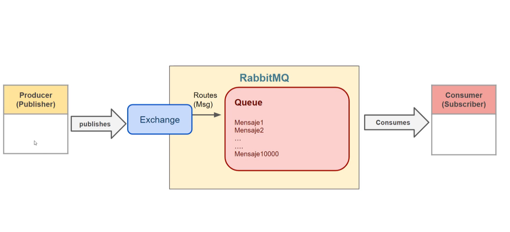
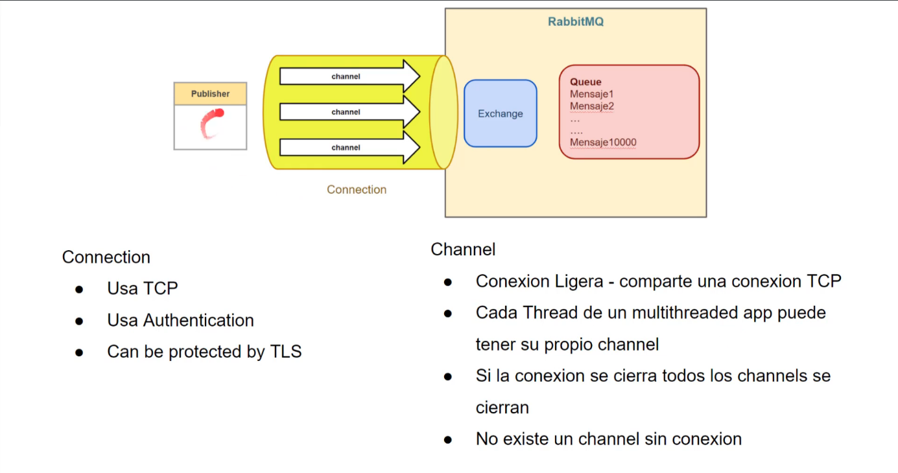
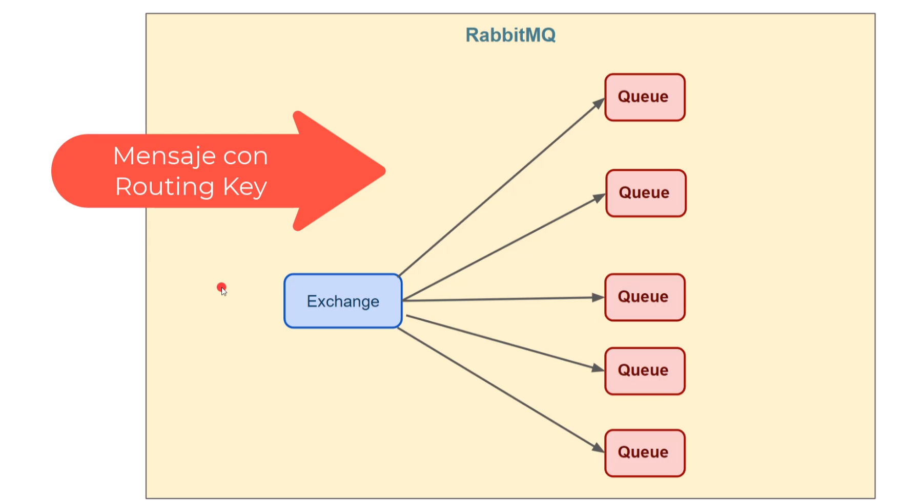
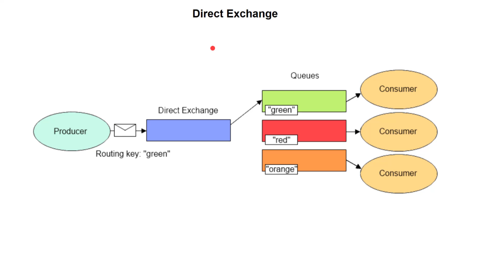
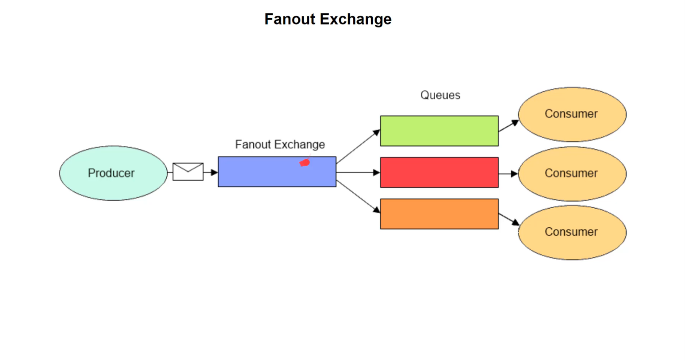
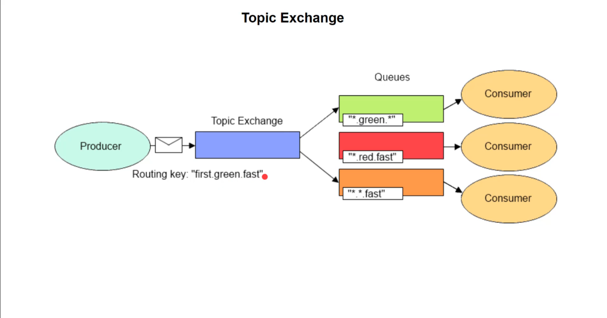
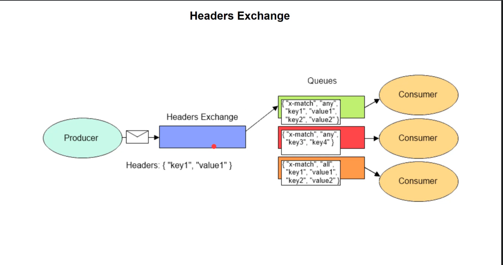
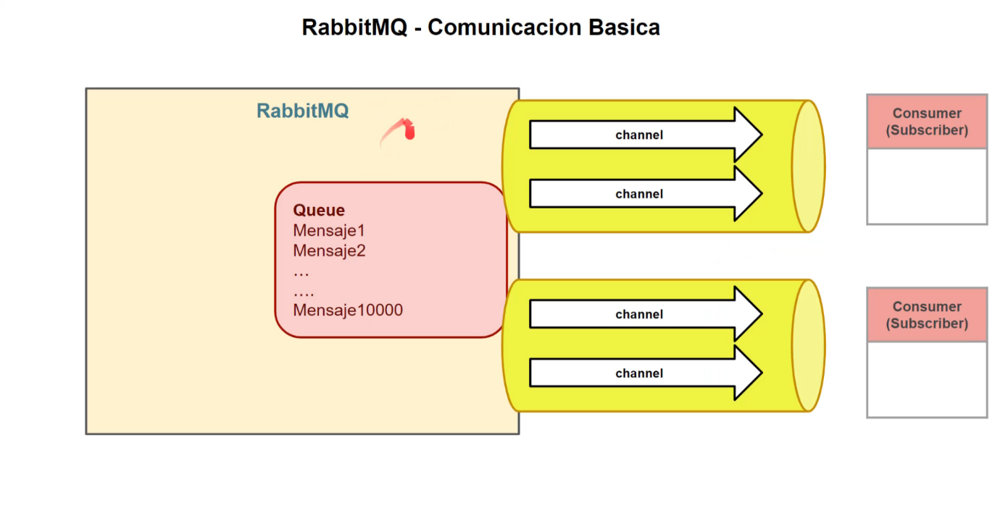

# ventajas de usar docker

- Retorno de inversion
- mas velocidad
- aislamineto y seguridad
- posibilidad de probar el mismo codigo en diferentes entornnos
- facilidad de testing
- menos coste para los test
- menos espacio de almacenamiento
- portabilidad
- facilidad de despliegue de aplicaiones al entorno de ejecucion o produccion

# comandos basicos

```bash
# comando para ejecutar una imagen y levantar con container
docker run hello-world
# listar los container
docker ps
# lsitar todos lso all contianer 
docker ps --all
```

# Comunicacion interna de RABBIT MQ


- Producer o Publisher tiene la tarea principal de enviar un mensaje un broker, al llegar al mensaje al broker es recivido por el componente Exchamge
- El Consumer o Subscriber lee el mensajes del Queue y lo consume

## Comunicacion entre publisher y rabbit MQ


- El publisher usa el AMQP (advanced meesage queueing protocol) donde se crea una `Connection` que crea el lazo entre el publisher y exchange.
- Los mensajes que realiza el publish se hace atravez del `channel` atravez de `connection`.
- El publisher puede realizar muchos `channel` atravez de 1 solo `Connection`.
- Todo esto es manejado desde el Exchange.
- La `Connection` usa Authentication (user, password) 
- Si la `Connection`se cierra todos los `channel` se cierran

## Comunicacion entre Exchange y Queue

- La comunicacion de `exchange` se encuentra dentro del Brocker
- El `Exchange` puede ser por el `Broker` por default o por el `Publisher`
- Cada mensaje contiene un `Routing Key` que especifica la dirrecion a donde llegara la carta a quien se la enviara o recibiran
 
 ### Tipos De Exchange: Direct Exchange
 
- El Direct Exchange envia un mensaje a los Consumer usando un `Routing key`
 ### Tipos de Exchange: Fanout Exchange

- Este es usado para broad casting es usado apra multiples Queue
### Tipos de Exchange: Topic Exchange

- Este es usado para enviar un mensaje a un Grupo de Queue
### Tipos de Exchange: Headers Exchange

- Muy Silimiar a Topic Exchange la diferencia principal es que debe considir lso header  del mensaje con los header del Queue

## Comunicacion entre Queue y Consumer (Subscriber)

- El Subscriber tambien necesita crear el tipo `Conection` donde dentro de este, puede existir los `Channels`
- un Queue Puede ser implementado a multiples `channels`

```c#
// SENDER BASIC Connection
using System.Text;
// Set connection
var factory = new ConnectionFactory
{
  HostName = 'localhost',
  Username = "guest",
  Password = "guestPassword",
};
// Create Connection
using var connection =  factory.CreateConnection();

// Create Channel
using var channel = connection.CreateModel();

 // La queue se declara desde el Channel
channel.QueueDeclare("BasicQueue", false,false,false,null);
var message = "Hello world";
var body = Encoding.UTF8.GetBytes(message);
// Aqui se declara el routekey
channel.BasicPublish("", "BasicQueue", null, body);
Console.WriteLine("El mensaje fue enviado");


```
```c#
// SENDER BASIC Connection
using System.Text;
// Set connection
var factory = new ConnectionFactory
{
  HostName = 'localhost',
  Username = "guest",
  Password = "guestPassword",
};
// Create Connection
using var connection =  factory.CreateConnection();
// Create Channel
using var channel = connection.CreateModel();

// La queue se declara desde el Channel
channel.QueueDeclare("BasicQueue", false,false,false,null);
var consumer = new EventingBasicConsumer(channel);
// Ea funcion que se ejecuta cuando el consumer recive un mensaje
consumer.Recieved += (model, ea) =>
{
  var body = ea.Body;
  var message = Encoding.UTF8.GetString(body);
  Console.WriteLine($"El mensaje fue recivido: {message}");
};
// una vez leidos los mensajes estos sean quitados del QUeue
channel.BasicConsume("BasicQueue", true, consumer);


```